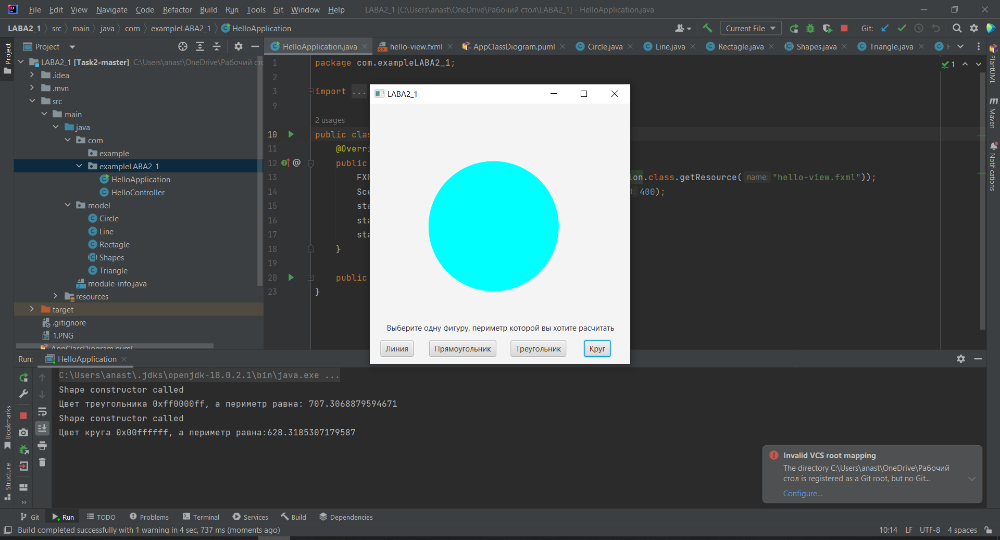

# ПРАКТИЧЕСКАЯ РАБОТА №2

## В ходе практической работы было реализованны :
- Абстрактный супер класс Shapes
- - Абстрактный метод Draw, класса Shapes
- Класс Line, наследующий класс Shapes, который контроллирует логическое выполнение рисования линии и вычисления её длинны
- Класс Rectagle, наследующий класс Shapes, который контроллирует логическое выполнение рисования квадрата и вычисление его периметра
- Класс Triagle, наследующий класс Shapes, который контроллирует логическое выполнение рисования треугольника и вычисление его периметра
- Класс Circle, наследующий класс Shapes, который контроллирует логическое выполнение рисования круга и вычисления его периметра
